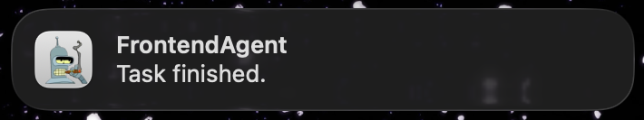

# Puff: MacOS Terminal Notifier For AI Agents

<p align="center">
  
</p>

CLI tool for your favorite AI agent to send you macOS notifications when it's task is done.
<p align="center">

</p>

## Install

Install via Homebrew (the tap will be auto-added):

```sh
brew install vossenwout/puff/puff
```

Homebrew keeps `puff` and `Puff.app` together under the Cellar so no extra setup is required.
## Usage

1. Enable puff notifications in macOS notification settings
2. Test it manually. From your terminal, run:
   ```sh
   puff <NameOfYourAgent>
   ```
3. Instruct your favorite cli agent (codex, claude code, cursor cli) to invoke the puff command when a task is done.

## Local Build

1. Run the bundler to produce `dist/puff` and `dist/Puff.app` (release build by default, set `CONFIG=debug` if you prefer):
   ```sh
   Scripts/build_and_bundle.sh
   ```
3. Symlink the CLI somewhere on your `$PATH`:
   ```sh
   ln -sf "$PWD/dist/puff" /usr/local/bin/puff   # adjust path as needed
   ```
Keep `Puff.app` next to the CLI (i.e., leave both files inside `dist/` or copy them together somewhere else); the wrapper looks for the helper in the same directory.


### Debugging

Set `PUFF_DEBUG=1` when launching to surface the helper’s internal log lines:

```sh
PUFF_DEBUG=1 ./dist/puff assistantA
```

Without the flag, the CLI stays silent on success just like terminal-notifier.

## Releasing

Tag and push the new version:
```sh
git tag v0.2.0 && git push origin v0.2.0
```
Tags must be in the format `vMAJOR.MINOR.PATCH`.

## Contact

Questions, bugs, or feature ideas? Open an issue at https://github.com/vossenwout.
